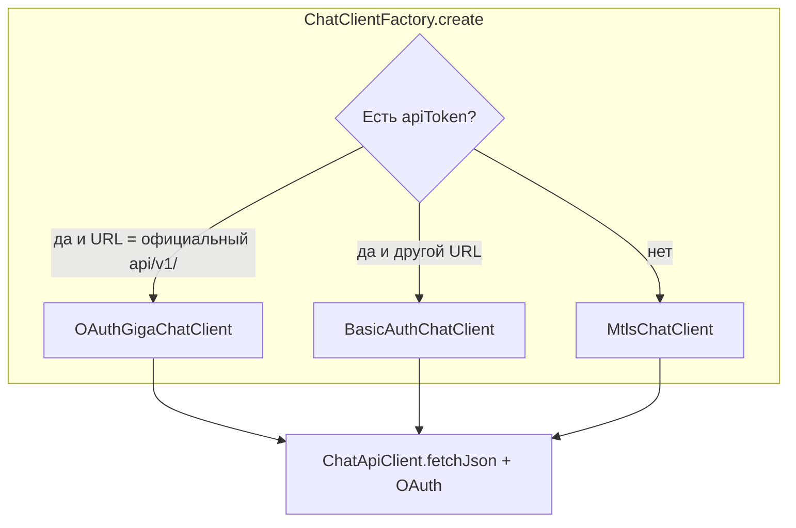

# gigachat-openai-client

**gigachat-openai-client** — npm-библиотека для Node.js: доступ к API GigaChat в стиле OpenAI Chat Completions (`models`, `chat/completions` относительно `baseUrl`). Реализованы OAuth (официальный облачный эндпоинт), прямой Basic Auth на произвольный URL, заготовка под mTLS, общая обработка TLS (корпоративные CA, отладка), трассировка и отмена запросов.

Исходный код клиента — [`llm-client.ts`](./llm-client.ts); после **`npm run build`** публикуется как ESM-модуль из каталога **`dist/`**.

### Установка

```bash
npm install gigachat-openai-client
```

### Пример

```typescript
import { ChatClientFactory } from "gigachat-openai-client";

const client = ChatClientFactory.create({
  baseUrl: "https://gigachat.devices.sberbank.ru/api/v1/",
  apiToken: process.env.GIGACHAT_AI_TOKEN!,
});
```

### Сборка и публикация (для разработчиков пакета)

**`npm run build`** — компиляция в **`dist/`**. Перед **`npm publish`** выполняется **`prepublishOnly`**. Проверить содержимое tarball без выгрузки: **`npm run pack:dry`**.

---

## Назначение `llm-client.ts`

Файл объединяет:

1. **Типы запросов/ответов** — описание тел JSON в формате, близком к OpenAI Chat Completions (`ChatRequest`, `ChatResponse`, сообщения, function calling).
2. **Три реализации клиента** — разные схемы авторизации к одному и тому же стилю URL.
3. **Фабрику** — автоматический выбор реализации по базовому URL и наличию токена.
4. **Общую инфраструктуру** — трассировка вызовов, отмена долгих запросов, TLS для корпоративных сетей, сериализация тела запроса под особенности GigaChat.

Ниже — как это устроено по слоям.

---

## Архитектура (обзор)



- Все конкретные клиенты наследуют **`ChatApiClient`** и реализуют `getModels()` и `postChatCompletions()`.
- HTTP к API идёт через **`fetchJson`**: единая точка для `fetch`, TLS, трассировки и ошибок.

---

## Фабрика: `ChatClientFactory`

Опции — **`ChatClientFactoryOptions`**:

| Поле | Роль |
|------|------|
| `baseUrl` | Базовый URL API (со слэшем на конце или без — внутри нормализуется к виду `…/`) |
| `apiToken` | Строка токена или `null`/`undefined` |
| `clientCertificatePath`, `clientPrivateKeyPath` | Пути к клиентскому сертификату и ключу (только при ветке без токена) |

**Правила выбора класса:**

1. **`apiToken` задан** и после нормализации URL **строго равен**  
   `https://gigachat.devices.sberbank.ru/api/v1/`  
   → **`OAuthGigaChatClient`**.  
   Значение — **Basic credentials для OAuth** (не готовый Bearer): см. ниже.

2. **`apiToken` задан**, но URL **другой** (прокси, другой хост, другой путь)  
   → **`BasicAuthChatClient`**: тот же токен в заголовке `Authorization: Basic …` на ваш `baseUrl`.

3. **`apiToken` не задан**  
   → **`MtlsChatClient`** (клиентский сертификат). Сейчас **`buildMtlsFetchExtras()`** возвращает `{}` — для Node нужно подставить `dispatcher`/`https.Agent` с `cert`/`key` из путей в конфиге.

---

## Базовый класс: `ChatApiClient`

- **Нормализация URL**: в конструкторе к `baseUrl` добавляется завершающий `/`, если его не было.
- **`fetchJson(url, init, signal?)`**:
  - Проверяет **`Cancelable`** (если передан): перед запросом и после — `checkCanceled()`.
  - Пишет **трассировку** в **`HttpCallTraceStore`**: URL, тело запроса (форматирование JSON, если возможно), ответ, статус, длительность; при ошибке сети — запись с `error`.
  - Вызывает **`fetch`** с объединением опций: сначала **`tlsFetchInit()`** (кастомный TLS через `undici.Agent`), затем ваши `init`, затем `signal`.
  - Раз в **500 ms** проверяет отмену: если `cancelable` перевёлся в «отменено», **абортирует** `AbortController`, чтобы прервать `fetch`.
  - Успех: `response.ok` → парсит JSON в тип `T`. Иначе бросает **`HttpError`** с телом ответа, кодом статуса и URL.

Ошибки сети оборачиваются в `Error("HTTP request failed: …")` с **`cause`**, после записи в трассировку.

---

## TLS: `tlsFetchInit` и переменные окружения

Встроенный **`fetch`** в Node использует **undici**. Для корпоративных CA или отладки TLS добавлен общий **`Agent`**:

| Переменная | Поведение |
|------------|-----------|
| **`GIGACHAT_TLS_CA_FILE`** | Путь к PEM-файлу (абсолютный или относительно `process.cwd()`). Содержимое **добавляется** к **`tls.rootCertificates`**; проверка сертификата **включена**. Имеет приоритет над «небезопасным» режимом. |
| **`GIGACHAT_TLS_INSECURE`** | Значения `1` или `true`: **`rejectUnauthorized: false`** — цепочка не проверяется. **Только если CA-файл не задан.** Небезопасно, только для отладки/изолированной сети. |

Агенты кэшируются (отдельно для CA-пути и для insecure-режима).

Дополнительно в среде можно использовать стандарт Node **`NODE_EXTRA_CA_CERTS`** (файл с доп. CA), если загрузка окружения происходит до первых TLS-запросов.

**Важно:** запрос OAuth в **`OAuthGigaChatClient.ensureAccessToken`** тоже использует **`...tlsFetchInit()`** — те же правила TLS действуют и на `https://ngw.devices.sberbank.ru:...`, и на запросы к `baseUrl`.

---

## `OAuthGigaChatClient` (официальный облачный GigaChat)

- **OAuth**: `POST` на `https://ngw.devices.sberbank.ru:9443/api/v2/oauth` (константа `SBER_OAUTH_TOKEN_URL` в коде).  
  Тело: `application/x-www-form-urlencoded`, поле `scope=GIGACHAT_API_PERS`.  
  Заголовки: `Authorization: Basic` + секрет, `RqUID` — случайный UUID (`randomUUID()` из `node:crypto`).
- Ответ JSON: `access_token`, `expires_at` (мс). Пока текущее время меньше `expires_at`, повторный OAuth не делается.
- Запросы к **`baseUrl`** (`…/models`, `…/chat/completions`): **`Authorization: Bearer`** + полученный `access_token`.

В `GIGACHAT_AI_TOKEN` / **`ChatClientFactoryOptions.apiToken`** для этой ветки нужен **ключ в формате Basic** (как выдаёт Сбер для API), а не уже готовый Bearer.

---

## `BasicAuthChatClient`

- На **любой** `baseUrl` отправляет **`Authorization: Basic`** с вашим токеном для обоих методов.
- Подходит для совместимых шлюзов, где не нужен отдельный OAuth к `ngw.devices.sberbank.ru`.

---

## `MtlsChatClient`

- Сценарий **без** `apiToken`, с **`clientCertificatePath` / `clientPrivateKeyPath`** в опциях фабрики.
- **`buildMtlsFetchExtras()`** сейчас возвращает `{}` — заготовка под **`dispatcher`** с клиентским сертификатом в Node.

---

## Сериализация тела запроса

Внутренние функции **`serializeChatRequestBody`** / **`serializeChatMessageForApi`**:

- В JSON всегда попадает поле **`content`**, в т.ч. **`null`** — так ожидает GigaChat для части сценариев.
- Для **function call** в TypeScript **`arguments`** хранится **строкой** (как JSON), а в тело запроса уходит **распарсенный объект** (`parseFunctionArgumentsJson`), потому что GigaChat ожидает **объект**, а не строку.

Поля `functions` и `function_call` в корне запроса добавляются только если они заданы (не `null`/`undefined`).

---

## Трассировка: `HttpCallTraceStore`

Глобальный буфер (до **500** последних записей типа **`HttpCallTrace`**): идентификатор, время, URL, JSON запроса/ответа, HTTP-статус, длительность, при сбое — текст ошибки. Методы: **`nextTraceId`**, **`record`**, **`getAll`**, **`clear`**.

---

## Отмена: `Cancelable` / `CancelFlag`

Опционально передаётся в конструкторы клиентов. При вызове **`cancel()`** последующие **`checkCanceled()`** бросают ошибку, а активный **`fetch`** стараются прервать через **AbortSignal**.

---

## Ошибки: `HttpError`

Наследник `Error`: помимо сообщения (часто тело ответа сервера) доступны **`statusCode`** и **`url`**.

---

## Связь с `llm-test.ts`

Скрипт загружает **`.env`** (`dotenv/config`), читает переменные и вызывает **`ChatClientFactory.create({ baseUrl: …, apiToken: … })`**, затем **`postChatCompletions`**. Переменные окружения для теста:

| Переменная | Назначение |
|------------|------------|
| `GIGACHAT_AI_TOKEN` | Обязательна для текущего сценария |
| `GIGACHAT_AI_URL` | По умолчанию официальный `…/api/v1/` |
| `GIGACHAT_MODEL`, `GIGACHAT_PROMPT` | Модель и текст запроса |
| `GIGACHAT_TLS_CA_FILE`, `GIGACHAT_TLS_INSECURE` | См. раздел TLS |

Запуск (нужен Node с поддержкой загрузки `.ts`, например флаг типов):

```bash
npm test
# или
node --experimental-transform-types llm-test.ts
```

---

## Зависимости, влияющие на `llm-client.ts`

- **`undici`** — `Agent` для кастомного TLS в **`fetch`**.
- Остальное — модули Node: `fs`, `path`, `tls`, `crypto` (`randomUUID`).

---

## Краткая шпаргалка по выбору режима

| Условие | Клиент |
|---------|--------|
| URL = `https://gigachat.devices.sberbank.ru/api/v1/` и есть токен | `OAuthGigaChatClient` (OAuth → Bearer) |
| Другой URL и есть токен | `BasicAuthChatClient` (Basic) |
| Нет токена | `MtlsChatClient` (mTLS — доработать `buildMtlsFetchExtras`) |

Если документация расходится с кодом, ориентируйтесь на актуальную реализацию в **`llm-client.ts`** (в опубликованном пакете — на собранные файлы в **`dist/`**).
